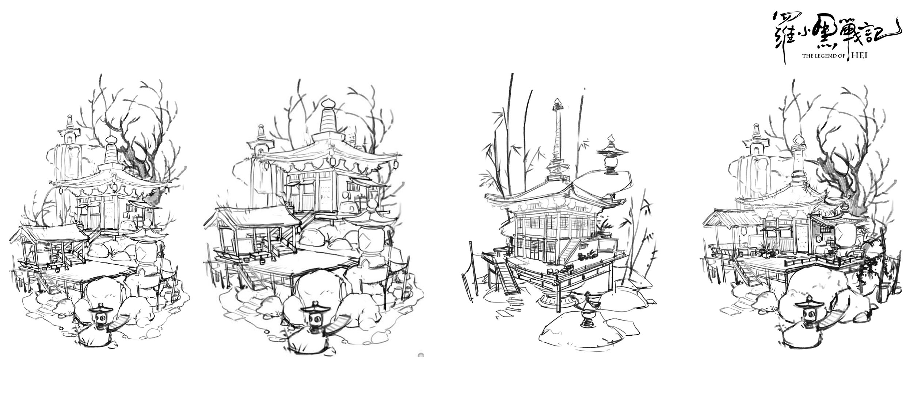
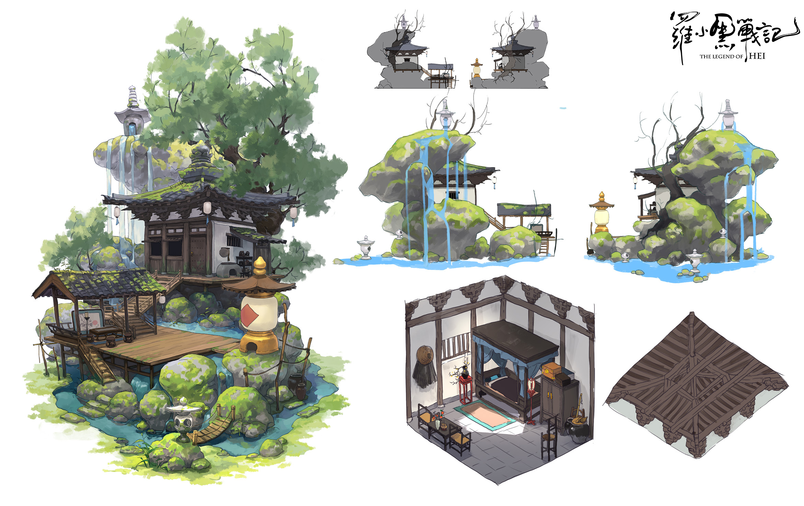
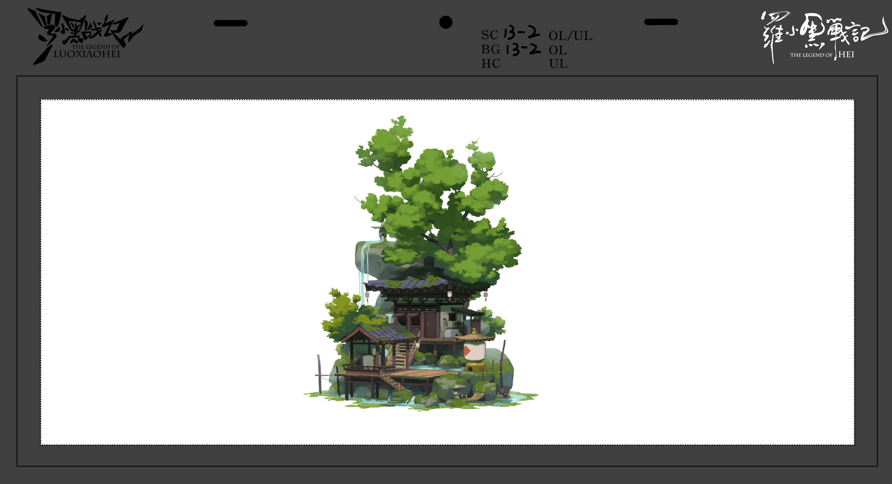

# 无限的灵质空间

这是无限三百年前隐居的地方，离开前他把小屋和山石一起吞噬了，水池底部与最高处有微型空间点，形成水循环

<figure><figcaption></figcaption></figure>

<figure><figcaption></figcaption></figure>

<figure><figcaption></figcaption></figure>

<figure><figcaption></figcaption></figure>
