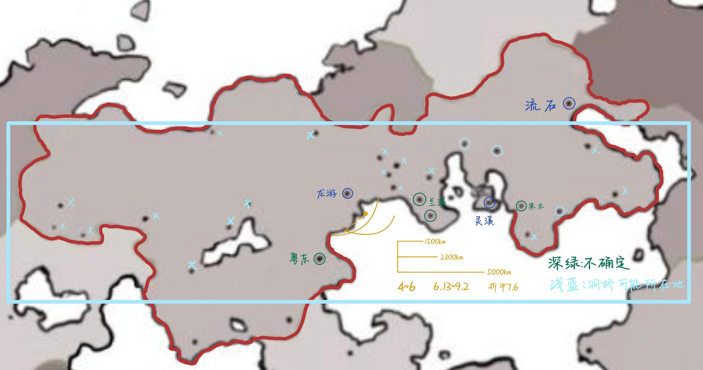

# 各地会馆

截至无限415年（电影一）全球已有84个会馆

<figure><figcaption></figcaption></figure>

#### 已知会馆（14/84）

苍南（主会馆），龙游，流石，寒木，粤东，洞桥，黄河，河海，榕城，花间，茂竹，风灵，灵溪，燕京


[cang-nan-hui-guan.md](cang-nan-hui-guan.md)



[long-you-hui-guan.md](long-you-hui-guan.md)



[liu-shi-hui-guan.md](liu-shi-hui-guan.md)



[han-mu-hui-guan.md](han-mu-hui-guan.md)



[yue-dong-hui-guan.md](yue-dong-hui-guan.md)



[dong-qiao-hui-guan.md](dong-qiao-hui-guan.md)



[huang-he-hui-guan.md](huang-he-hui-guan.md)



[he-hai-hui-guan.md](he-hai-hui-guan.md)



[rong-cheng-hui-guan.md](rong-cheng-hui-guan.md)



[hua-jian-hui-guan.md](hua-jian-hui-guan.md)



[mao-zhu-hui-guan.md](mao-zhu-hui-guan.md)



[ling-xi-hui-guan.md](ling-xi-hui-guan.md)



[wu-ming-hui-guan.md](wu-ming-hui-guan.md)


<a href="../" class="button primary" data-icon="align-justify">场景地图目录页</a>

***

<a href="../xing-guo-di-tu.md" class="button primary" data-icon="align-justify">兴国地图</a><a href="../shi-jie-di-tu.md" class="button primary" data-icon="align-justify">世界地图</a><a href="../di-qiu.md" class="button primary" data-icon="align-justify">地球</a><a href="./" class="button primary" data-icon="align-justify">各地会馆</a><a href="../dian-ying-yi/" class="button primary" data-icon="align-justify">电影一</a><a href="../dian-ying-er/" class="button primary" data-icon="align-justify">电影二</a><a href="../zhong-sheng-zhi-men-pian-zhang.md" class="button primary" data-icon="align-justify">众生之门篇章</a>

***

<a href="./" class="button primary" data-icon="align-justify">各地会馆</a>

***

<a href="cang-nan-hui-guan.md" class="button primary" data-icon="align-justify">苍南会馆</a><a href="long-you-hui-guan.md" class="button primary" data-icon="align-justify">龙游会馆</a><a href="liu-shi-hui-guan.md" class="button primary" data-icon="align-justify">流石会馆</a><a href="han-mu-hui-guan.md" class="button primary" data-icon="align-justify">寒木会馆</a><a href="yue-dong-hui-guan.md" class="button primary" data-icon="align-justify">粤东会馆</a><a href="dong-qiao-hui-guan.md" class="button primary" data-icon="align-justify">洞桥会馆</a><a href="huang-he-hui-guan.md" class="button primary" data-icon="align-justify">黄河会馆</a><a href="he-hai-hui-guan.md" class="button primary" data-icon="align-justify">河海会馆</a><a href="rong-cheng-hui-guan.md" class="button primary" data-icon="align-justify">榕城会馆</a><a href="hua-jian-hui-guan.md" class="button primary" data-icon="align-justify">花间会馆</a><a href="mao-zhu-hui-guan.md" class="button primary" data-icon="align-justify">茂竹会馆</a><a href="ling-xi-hui-guan.md" class="button primary" data-icon="align-justify">灵溪会馆</a><a href="wu-ming-hui-guan.md" class="button primary" data-icon="align-justify">无名会馆</a>
