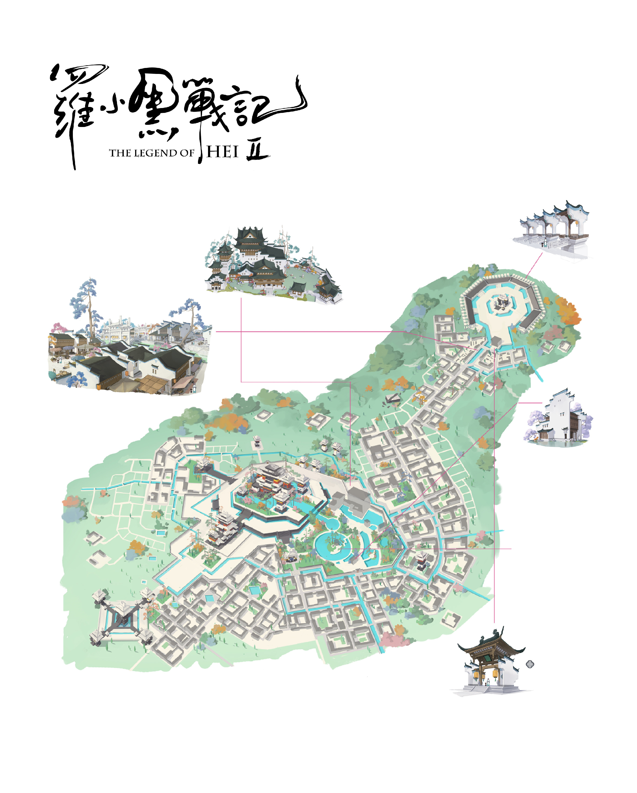
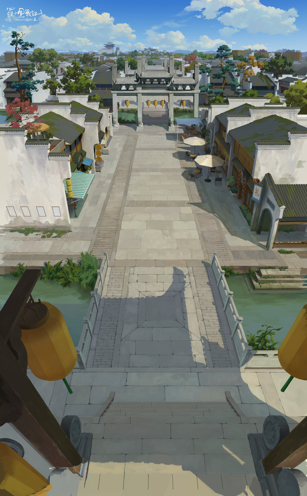
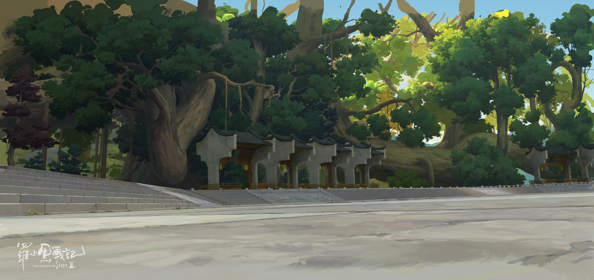
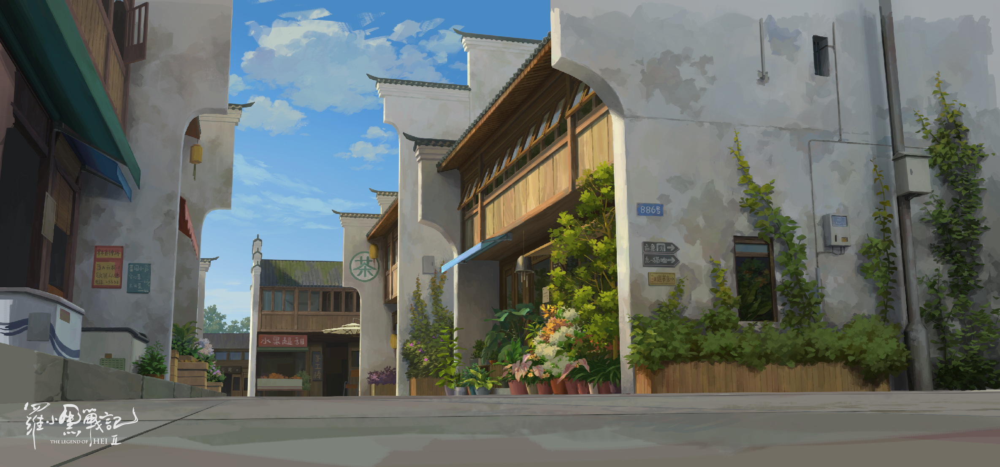
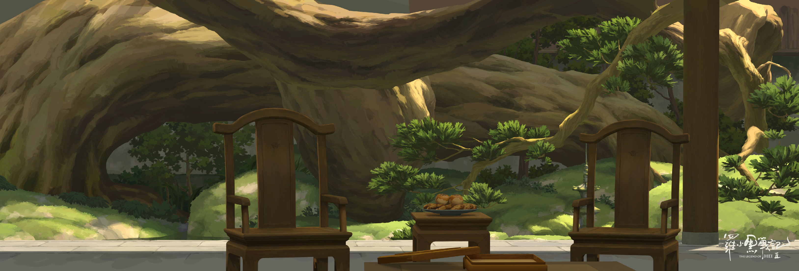
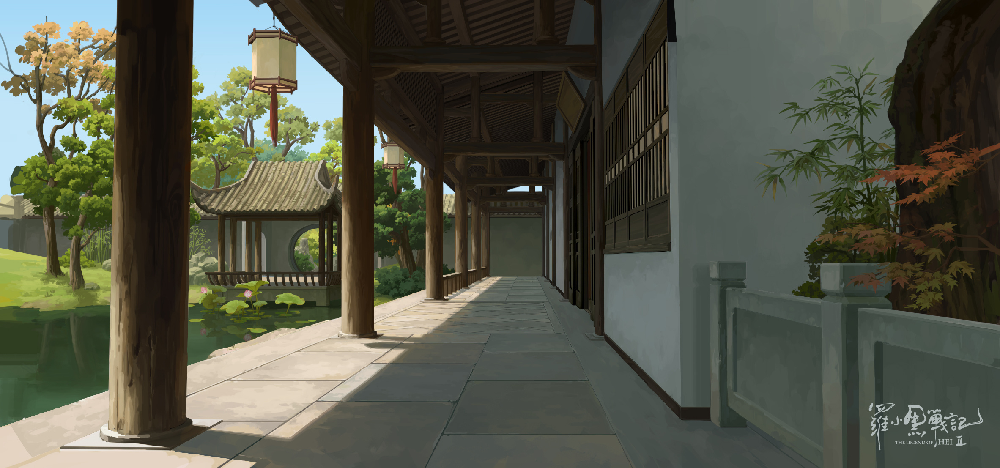
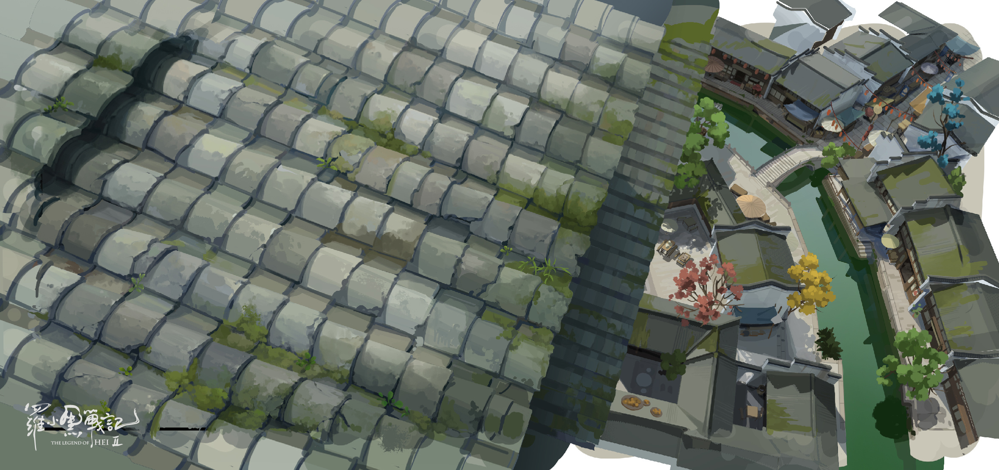
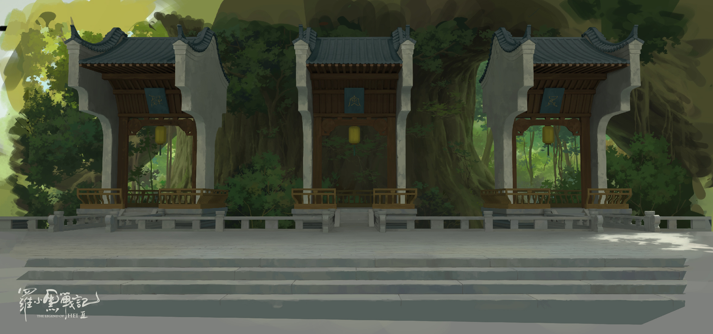
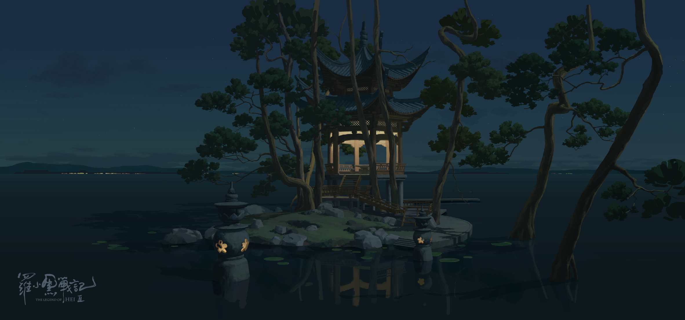

# 苍南会馆

<figure><figcaption></figcaption></figure>

<figure><figcaption></figcaption></figure>

<figure><figcaption></figcaption></figure>

<figure><figcaption></figcaption></figure>

<figure><figcaption></figcaption></figure>

<figure><figcaption></figcaption></figure>

<figure><figcaption></figcaption></figure>

<figure><figcaption></figcaption></figure>

<figure><figcaption></figcaption></figure>

<figure><figcaption></figcaption></figure>

<figure><figcaption></figcaption></figure>

<figure><figcaption></figcaption></figure>

<figure><figcaption></figcaption></figure>

<figure><figcaption></figcaption></figure>

<figure><figcaption></figcaption></figure>

<a href="./" class="button primary" data-icon="align-justify">各地会馆</a>

***

<a href="cang-nan-hui-guan.md" class="button primary" data-icon="align-justify">苍南会馆</a><a href="long-you-hui-guan.md" class="button primary" data-icon="align-justify">龙游会馆</a><a href="liu-shi-hui-guan.md" class="button primary" data-icon="align-justify">流石会馆</a><a href="han-mu-hui-guan.md" class="button primary" data-icon="align-justify">寒木会馆</a><a href="yue-dong-hui-guan.md" class="button primary" data-icon="align-justify">粤东会馆</a><a href="dong-qiao-hui-guan.md" class="button primary" data-icon="align-justify">洞桥会馆</a><a href="huang-he-hui-guan.md" class="button primary" data-icon="align-justify">黄河会馆</a><a href="he-hai-hui-guan.md" class="button primary" data-icon="align-justify">河海会馆</a><a href="rong-cheng-hui-guan.md" class="button primary" data-icon="align-justify">榕城会馆</a><a href="hua-jian-hui-guan.md" class="button primary" data-icon="align-justify">花间会馆</a><a href="mao-zhu-hui-guan.md" class="button primary" data-icon="align-justify">茂竹会馆</a><a href="ling-xi-hui-guan.md" class="button primary" data-icon="align-justify">灵溪会馆</a><a href="wu-ming-hui-guan.md" class="button primary" data-icon="align-justify">无名会馆</a>
