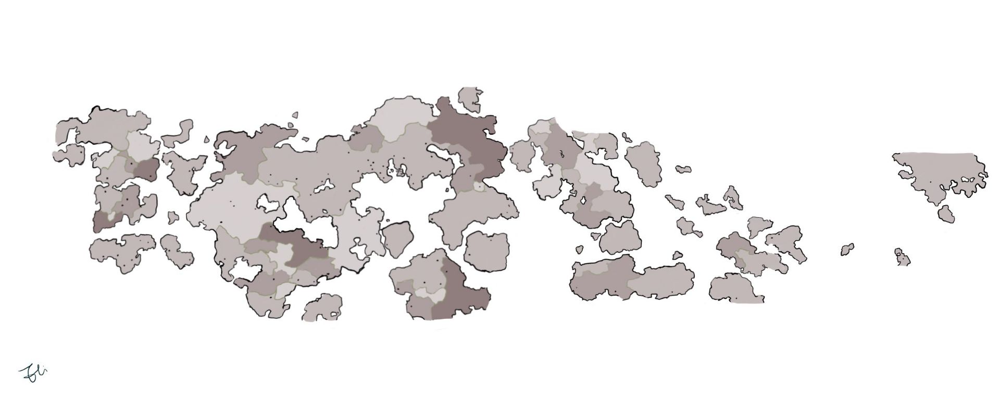

# 世界地图

<figure><figcaption></figcaption></figure>

<a href="./" class="button primary" data-icon="align-justify">场景地图目录页</a>

***

<a href="xing-guo-di-tu.md" class="button primary" data-icon="align-justify">兴国地图</a><a href="shi-jie-di-tu.md" class="button primary" data-icon="align-justify">世界地图</a><a href="di-qiu.md" class="button primary" data-icon="align-justify">地球</a><a href="ge-di-hui-guan/" class="button primary" data-icon="align-justify">各地会馆</a><a href="dian-ying-yi/" class="button primary" data-icon="align-justify">电影一</a><a href="dian-ying-er/" class="button primary" data-icon="align-justify">电影二</a><a href="zhong-sheng-zhi-men-pian-zhang.md" class="button primary" data-icon="align-justify">众生之门篇章</a>
