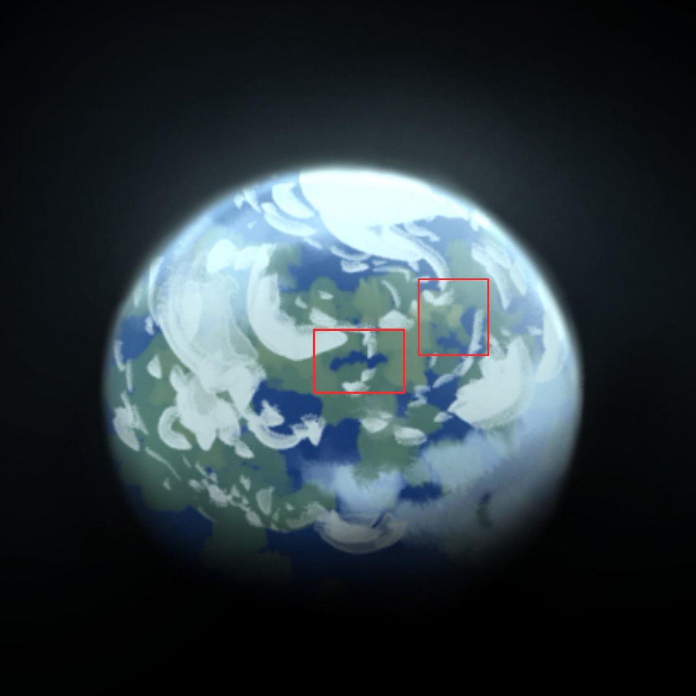
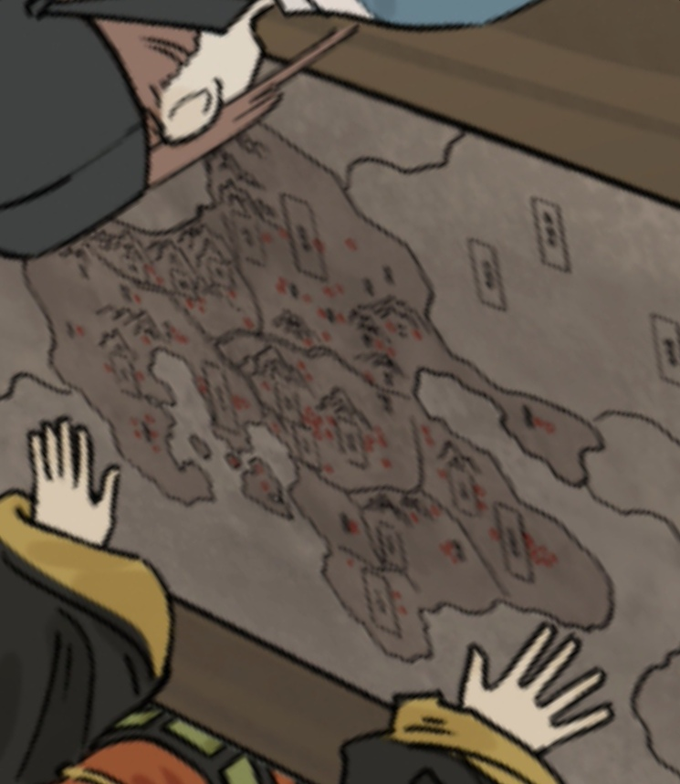
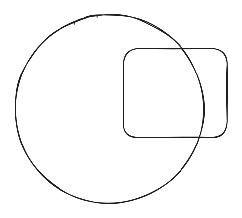

# Page 2

<figure><figcaption></figcaption></figure>

<figure><figcaption></figcaption></figure>

<figure><figcaption></figcaption></figure>



<table data-view="cards"><thead><tr><th data-type="files"></th><th data-type="checkbox"></th></tr></thead><tbody><tr><td><a href=".gitbook/assets/TV文本.pdf">TV文本.pdf</a></td><td>false</td></tr><tr><td><a href=".gitbook/assets/龙游3 (2).jpg">龙游3 (2).jpg</a></td><td>true</td></tr><tr><td></td><td>false</td></tr></tbody></table>



<figure><figcaption></figcaption></figure>

<figure><figcaption></figcaption></figure>



emmmm

zmdewefw



sdmqkfvjnhbkjlmked

qerve

* ertbvsfdc
* efvcdx
  * gfvfcdx
    * egvrbwtb
    * ebwrtbw
  * dgbebrwefd
* ebvbrt




[.](./)



{% column width="25%" %}

[Broken link](broken-reference)



{% column width="25%" %}

[liu-shi-hui-guan.md](shi-li-jie-shao/yao-jing-wei/yao-ling-hui-guan/liu-shi-hui-guan.md)




niojp

ytnmjjc




[Broken link](broken-reference)




<figure><figcaption></figcaption></figure>

 

<a href="page-2.md#second-tab" class="button primary">New button</a>/
