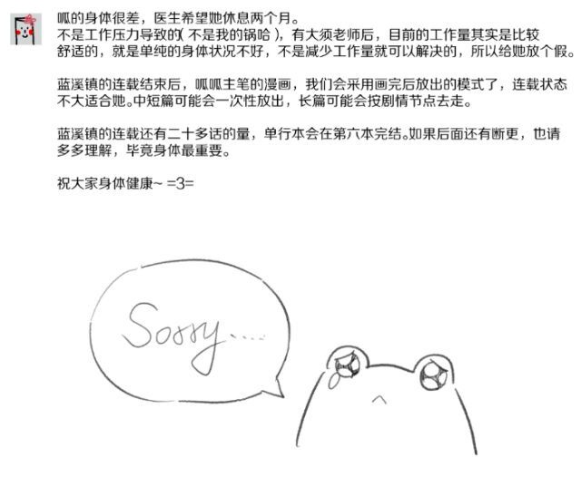
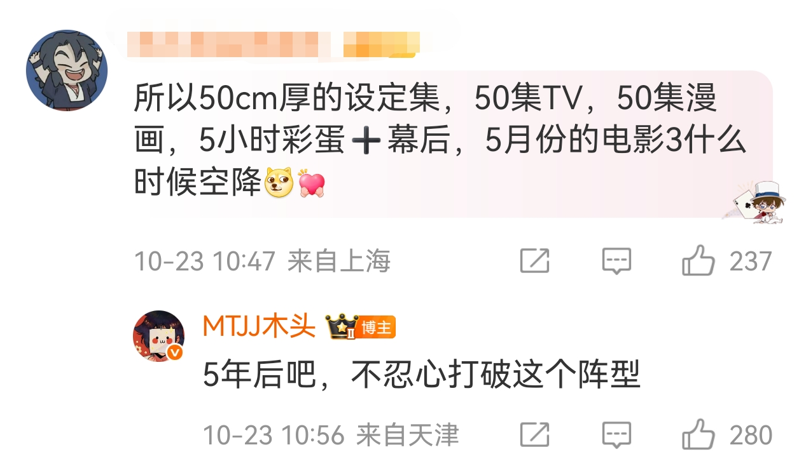

---
layout:
  width: default
  title:
    visible: true
  description:
    visible: true
  tableOfContents:
    visible: true
  outline:
    visible: true
  pagination:
    visible: true
  metadata:
    visible: true
---

# 木头发过的誓

### TV相关

* 2026.12.31之前出TV学前篇6集
* 大概在四十多集能知道阿根和玄离的关系
* TV最终规划是七八十集（黄渤那场采访）
* TV的名字有一个彩蛋，不过要等全都完了以后才会出现
* 《蓝溪镇》动画化有这个规划，可能会做成番剧，但还没有定，如果有合适的合作或者什么的就可以
* 有《罗小黑战记》以外的原创动画的打算
* 我们会有各种系列的动画，做电影是为了扩大团队

### 漫画相关

* 《蓝溪镇》之后是《剑圣无限》
* 重置《剑圣无限》、《神圣传说》、《灵魂之旅》
  * 《剑圣无限》、《神圣传说》均为长篇漫画
  * 《剑圣无限》讲述无限的故事，《神圣传说》为罗小黑同世界观漫画，《灵魂之旅》是同世界观下妖灵会馆的故事

<figure><figcaption></figcaption></figure>

* 阅读理解：即如果有非孙呱主笔的漫画仍可能采取连载，《剑圣无限》可能会按剧情点放出

### 电影相关

* 老君会有自己的独立电影（2019.9.15扬子晚报）
* 2030年以后出电影三（不确定是不是这个意思）

<figure><figcaption></figcaption></figure>

### 其他（一）

* 电影二下映之后出一个配音花絮合集
* 2027年或之后出电影二的设定集
* 阿根是以什么样的借口成为小白的哥哥留在爷爷家的？反正是一个很合理的借口，放心
* 以后会有玄离的故事
* 虚淮和谛听是认识的，可能会在其他故事里讲，以后会出现的
* 清凝和鹿野以后会认识的
* 规划的很多作品都是在同一个世界观里
* 很长时间不会再考虑游戏，有能力的时候再出一款让我们觉得骄傲的游戏，拿出去很有面的那种

### 其他（二）

* 小白是普通人，不会觉醒灵力
* 故事应该不会发展到小黑、小白成年，木头没有信心做到小白小学毕业
* 设定上小黑的头发会慢慢黑回去，得等到成年之后
* 不会专门出介绍能力设定一类的资料书
